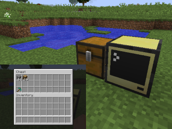

## Getting started with Plethora
One of the main features provided by Plethora is the ability to wrap almost any in-game object as a peripheral. This allows you to read data about that object and manipulate it using Lua. To see how this works let's place a chest next to a computer and open the Lua console.



> **Note:** If you're unfamiliar with ComputerCraft's peripherals, I really recommend you read through [this tutorial](http://www.computercraft.info/forums2/index.php?/topic/15062-peripheral-basics/) first.

Now you've got a Lua console open you'll want to "wrap" the peripheral and start using it:

```lua
chest = peripheral.wrap("<side>") -- Specify the side the chest is on.
print(chest)
```

You should get something like `table: 522c4804`, if you don't then check that you've specified the correct side.

Lets start by listing all available methods and a brief synopsis of each one. For this we can use the `.getDocs()` method:

```lua
chest.getDocs()

-- You should get something like:
{
  getMetadata = "function():table -- Get metadata about this object.",
  list = "function():table -- List all items in this inventory",
  getItem = "function(slot:integer):table|nil -- The item in the specified slot. The slot number starts from 1.",
  ...
}
```

I've only shown the first few methods for clarity, there are far too many to fit on the screen. If you want to find information about a specific method then you can pass the function name to the `.getDocs()` method. For instance `.getDocs("getMetadata")` would return the docstring for `.getMetadata()`.

Let's start using these methods then. The first one we'll look at is `.getMetadata()`. You can find this method on pretty much every object: it returns some basic information about the object. What information you get will vary depending on the object type: blocks will give you their name, items their name and stack size, entities will provide their health. The list goes on...

```lua
chest.getMetadata()

-- You should get something like:
{
  state = {
    facing = "east",
  },
  unlocalizedName = "tile.chest",
  name = "minecraft:chest",
  metadata = 5,
  displayName = "Chest",
}
```

So what does this tell us about the chest? To be fair, not a lot you didn't know already. You already knew it was a chest, so the only new information is the direction it is facing. However, when applied to arbitrary objects, knowing more about them becomes very useful.

But wouldn't it be more useful to know what was *inside* the chest? This is where the `.list()` method comes in. This will return a table listing all items within the chest.

```lua
chest.list()

-- You should get something like:
{
  {
    name   = "minecraft:cobblestone",
    count  = 64,
    damage = 0,
  },
  {
    name   = "minecraft:log",
    count  = 16,
    damage = 0,
  },
  [19] = {
    name   = "minecraft:diamond_pickaxe",
    count  = 1,
    damage = 0,
  },
}
```

Obviously the result will depend on what you've put in this chest but the idea is there: we can find out about the chest's contents. Maybe we want to find out a little more though: I wonder if that pickaxe has any enchantments? To get a specific item, we can use the `.getItem(slot)` method. We'll want to pass in 19, as that is where `.list()` told us the pickaxe count be found.

```lua
item = chest.getItem(slot)
print(item)
```

Once again, you should get something like `table: 4c812400`. This object represents a reference to this specific slot in the chest. Let's see what we can do with it.

Thankfully, this object is not-dissimilar to the chest: many of our familiar methods are also on the item. Let's start with `.getDocs()`.

```lua
item.getDocs()

{
  getMetadata = "function():table -- Get metadata about this object",
  drop = "function([limit:int][, direction:string]) -- Drop an item on the ground. Returns the number of items dropped",
}
```

Well, `.getMetadata()` will probably be useful for finding what enchantments it has.

```lua
item.getMetadata()

{
  maxDamage = 1561,
  toolClass = {
    pickaxe = 3,
  },
  maxCount = 1,
  displayName = "Diamond Pickaxe",
  count = 1,
  name = "minecraft:diamond_pickaxe",
  rawName = "item.pickaxeDiamond",
  material = "DIAMOND",
  damage = 0,
}
```

> **Note:** Getting an item's metadata is such a frequent task, there is a special method to do that: `.getItemMeta(slot)` will give you the metadata straight away, without having to go through `.getItem(slot)`.

Oh. It didn't have any. Well that is kinda boring. However, there is plenty of other useful information such as well, urm, yeah... Clearly this is a useless pick, let's get rid of it. Looks like `.drop()` will be useful for that!


```lua
item.drop(1, "up")
```

Look, it's gone! And good riddance to it! Now the item is gone, it doesn't make sense to be able to use this `item` object. Let's see what happens if we call `drop` again:

```lua
item.drop(1, "up")
-- lua:1: The stack is no longer there
```
Boom! It produced an error instead. You should always be careful when calling methods on objects to ensure you haven't got rid of them.

So, hopefully you have a vague idea of some of the things you can do with Plethora. Use the topics on the sidebar to explore.
